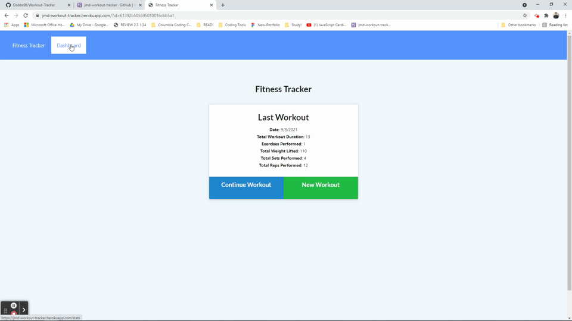

# Tech-Blog

## Description

In this app you will be able to keep track of you cardio and resistance workouts. Try to keep up on a daily on your daily workouts. But don't push it to hard. You can see how you did for past days too. Keep tracking and keep up the good work!

Check out the [live app](https://jmd-workout-tracker.herokuapp.com/?id=61392b505695010016cbb5a1)

## Licensing

For more information please check [GitHub Licensing](https://docs.github.com/en/github/creating-cloning-and-archiving-repositories/creating-a-repository-on-github/licensing-a-repository)

## Table of Contents

- [Tests](#tests)
- [Acceptance Criteria](#acceptance-criteria)
- [Usage](#usage)
- [Questions](#questions)

## Tests

[Full video demo](https://drive.google.com/file/d/12xYwHamyaU7GA9poxttJm9AGY3_mmUrY/view)

## Acceptance Criteria

The user should be able to:

- [x] Add exercises to the most recent workout plan.

- [x] Add new exercises to a new workout plan.

- [x] View the combined weight of multiple exercises from the past seven workouts on the `stats` page.

- [x] View the total duration of each workout from the past seven workouts on the `stats` page.

## Usage

- express
- mongoose
- morgan
- nodemon
- Robo 3T

## Questions

- Check my GitHub [Dobbs96](https://github.com/Dobbs96)
